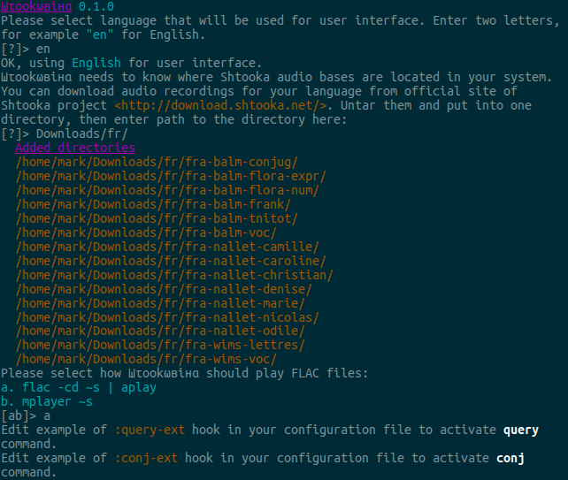
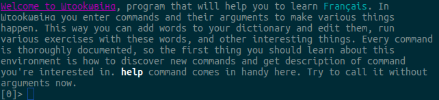
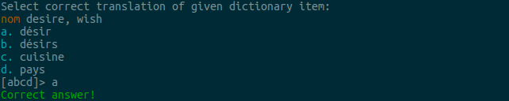
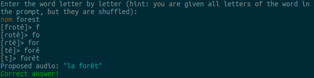
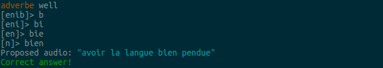
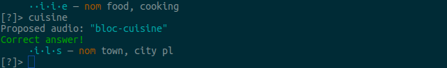

# Шτookωвiнα

*Шτookωвiнα está en fase beta. Dale una oportunidad.*

Este programa está diseñado para serle útil a estudiantes de
idiomas. Éstas son algunas características de Шτookωвiнα:

* utiliza grabaciones del [Proyecto Shtooka](http://shtooka.net/),
  estas grabaciones son hechas por hablantes nativos voluntarios, en vez
  de robots;

* tiene una interfaz de línea de comandos minimalista que incluso intenta
  ser amigable con ayuda de [cl-readline](https://github.com/mrkkrp/cl-readline)
  y de [cl-ansi-term](https://github.com/mrkkrp/cl-ansi-term);

* tiene varios ejercicios que le ayudarán al usuario a trabajar diferentes
  aspectos a la hora de recordar una palabra: traducción, escritura y escucha;

* tiene también ejercicios de «crucigrama»;

* es totalmente hackeable a través del script de configuración escrito
  en Common Lisp, el usuario puede definir nuevos comandos y cambiar
  absolutamente todo en Шτookωвiнα;

* este programa no hace ninguna suposición sobre el idioma a aprender,
  esto permite añadir definiciones de nuevos idiomas muy fácilmente;

* el idioma de la interfaz de usuario también puede ser especificado,
  las nuevas traducciones se hacen copiando existentes definiciones
  de idiomas de la interfaz de usuario y editando listas de cadenas de
  caracteres;

* para los usuarios que no conozcan Common Lisp existe Wizard que puede
  configurar la mayoría de los parámetros;

* existe también un tutorial interactivo incluido.

## Compilación e Instalación

El proceso de instalación es muy sencillo:

1. Instale [SBCL](http://www.sbcl.org/), Шτookωвiнα está escrito en estándar
   Common Lisp y no necesita ninguna característica en particular de SBCL,
   sin embargo solo la versión compilada con SBCL es testeada.

2. Instale [Quicklisp](http://www.quicklisp.org/) para automaticamente
   obtener todas las dependencias, en definitiva, esto es lo que hay que hacer:

   ```
   $ curl -O http://beta.quicklisp.org/quicklisp.lisp
   $ sbcl --load quicklisp.lisp
   * (quicklisp-quickstart:install)
   * (quit)
   ```

3. Instale [Buildapp](http://www.xach.com/lisp/buildapp/), particularmente
   la última versión:

   ```
   $ git clone https://github.com/xach/buildapp.git
   $ cd buildapp
   # make install
   ```

4. Descargue o clone el repositorio de Шτookωвiнα:

   ```
   $ git clone https://github.com/mrkkrp/shtookovina.git
   ```

5. Ejecute `cd` con el directorio resultante y compile el programa con `make`:

   ```
   $ cd shtookovina
   $ make
   ```

6. Ahora debería tener el binario de Шτookωвiнα en `build/shtk`, puede
   instalarlo de esta manera:

   ```
   # bash install.sh
   ```

7. Listo (puede ejecutar `uninstall.sh` para desinstalar el programa).

## ¿Cómo comenzar con Шτookωвiнα?

Шτookωвiнα puede ser usado para aprender varios idiomas al mismo tiempo.
En consecuencia debe mantener distintos diccionarios y archivos de
configuración para cada idioma a aprender. Debe especificar el idioma
con la opción `-t` o `--target`:

```
$ shtk -t en # si desea aprender Inglés
```

Esta opción es obligatorio. Para añadir nuevos idiomas utilice 
[ISO 639-2](http://www.loc.gov/standards/iso639-2/php/code_list.php) al
elegir el código de dos letras.

## Wizard and Audio

Now, you hopefully have installed Шτookωвiнα. However, it should be
configured before you can use it. Initially Шτookωвiнα was planned as a
hardcore program for Lisp geeks, but later we decided to make it more
user-friendly, so more people could use it. To make Шτookωвiнα work you're
supposed to write some Lisp in your configuration file setting some
variables and defining some hooks. Fortunately, we have wizard that can do
this automatically.



When you start Шτookωвiнα for the first time, wizard will be called (unless
you start it with `--no-wizard` option). First it asks about interface
language in English (it's default language, Шτookωвiнα will use your
preferred language as soon as it knows which one it is).

Second, Шτookωвiнα needs to know where audio databases are located in your
system. Шτookωвiнα uses databases from Shtooka project and for speed they
should be downloaded and placed in one directory. You can download the
databases from
[http://download.shtooka.net/](http://download.shtooka.net/). Don't forget
to uncompress the archives.

Third, the wizard will ask your how you would like to play audio files
(Shtooka project uses FLAC files). You should choose between listed options.

Finally, to use `query` and `conj` commands (open web-page with description
of given word or conjugation of given verb) you currently need to manually
edit relevant hooks in your configuration file, since we cannot know which
web-service your prefer to use for this task, and thus we cannot know how to
transform the word into URL.

## Tutorial

Шτookωвiнα has built-in interactive tutorial that shows basic commands:



The following topics are covered:

* How to find new commands and explore features of the program?

* How to get full description of any command?

* How to add words and phrases to user's dictionary?

* What sort of exercises can be used to remember these words?

* How to display information about the whole dictionary and detailed
  information about some specific entries?

## Exercises

Currently there are four different exercises:

### Translation



In this exercise you are given a word (either in interface language or
target language) and four possible translations. You should select correct
one.

### Word Constructor (writing)



You are given translation and letters of the word, but they are
shuffled. You need to enter the word correctly, letter by letter.

### Listening



Some relevant audio is played to you, you should recognize dictionary item
and enter it correctly.

### Crossword



This crossword doesn't show you visual representation of the crossing
words. It doesn't really matter if such representation can be drawn or
not. You cycle through various words and try to enter them correctly by
their description. If you don't know a word, you can skip it. If you enter a
word correctly, some letters of other words that coincide with the letters
of the entered word are revealed.

## How to contribute?

We need your help. There are many ways to help the project:

* define your language if it's missing, see `langs` directory for
  instructions and examples;

* translate user interface, see `ui-langs` directory for instructions and
  examples;

* translate this `README.md` file, append two-letter code of your language
  to the filename like this `README-fr.md` (for French);

* if you have encountered a bug, please
  [open an issue](https://github.com/mrkkrp/shtookovina/issues).

## License

Copyright © 2015 Mark Karpov

Distributed under GNU GPL, version 3.
